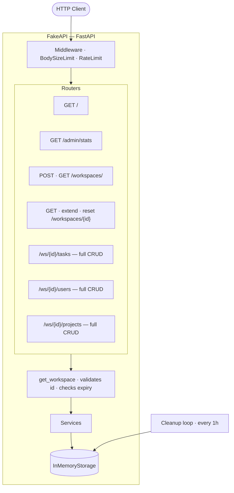
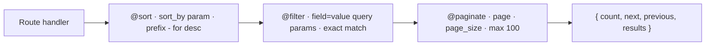
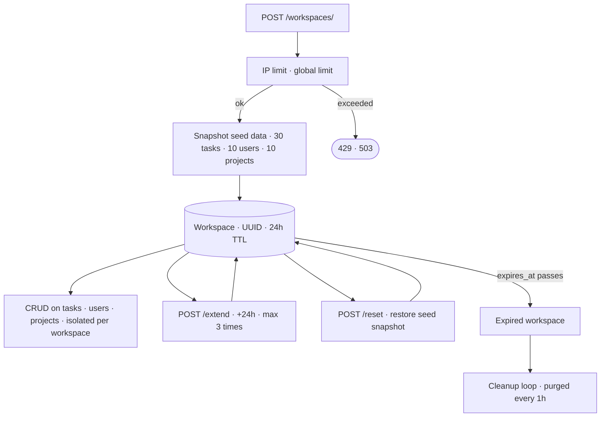
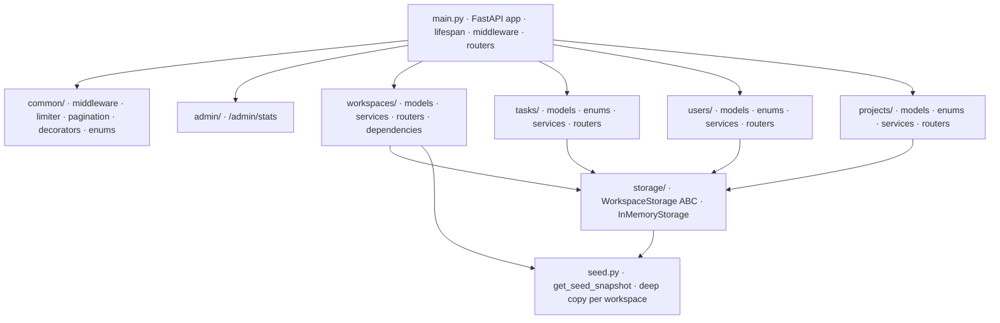

# Architecture

## System Overview

## Request Pipeline — List Endpoints

Every list endpoint runs through three stacked decorators before returning a response.

## Workspace Lifecycle

## Module Layout

