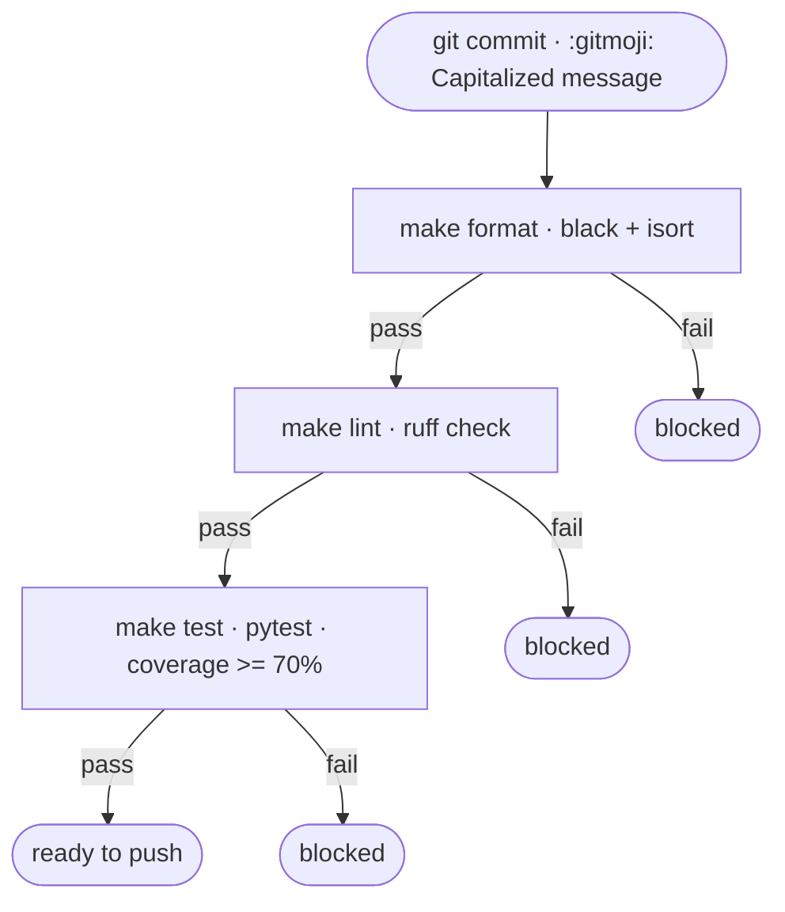

# CI

The project enforces a three-stage quality pipeline locally via `make`.

| Step | Command | Tool |
|---|---|---|
| Format | `make format` | black · isort |
| Lint | `make lint` | ruff |
| Test | `make test` | pytest · pytest-cov |
| All | `make check` | format → lint → test |

Commit format enforced: `:gitmoji: Capitalized message in English`
