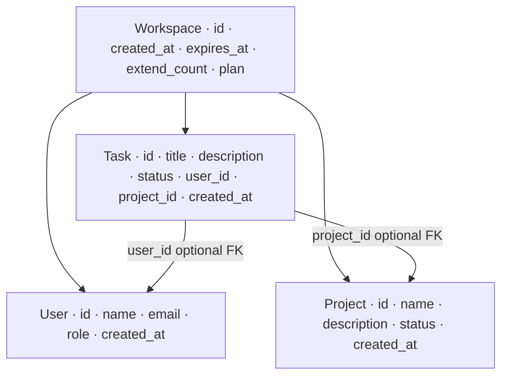
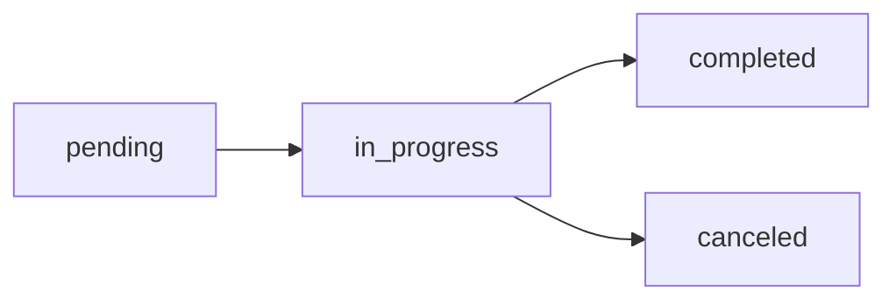

# Models

## Relations

## Workspace

| Field | Type | Notes |
|---|---|---|
| `id` | `str` | UUID v4, auto-generated |
| `created_at` | `datetime` | UTC, set on creation |
| `expires_at` | `datetime` | created_at + 24h |
| `extend_count` | `int` | increments on each `/extend`, max 3 |
| `plan` | `str` | always `free` |

## Task

| Field | Type | Constraints |
|---|---|---|
| `id` | `int` | auto-increment per workspace |
| `title` | `str` | 5–100 chars |
| `description` | `str` | 1–300 chars |
| `status` | `TaskStatus` | `pending` · `in_progress` · `completed` · `canceled` |
| `user_id` | `int` or `null` | optional reference to a User |
| `project_id` | `int` or `null` | optional reference to a Project |
| `created_at` | `datetime` | set on creation |

## User

| Field | Type | Constraints |
|---|---|---|
| `id` | `int` | auto-increment per workspace |
| `name` | `str` | 2–100 chars |
| `email` | `str` | valid email format |
| `role` | `UserRole` | `admin` · `member` · `viewer` |
| `created_at` | `datetime` | set on creation |

## Project

| Field | Type | Constraints |
|---|---|---|
| `id` | `int` | auto-increment per workspace |
| `name` | `str` | 2–100 chars |
| `description` | `str` | 1–500 chars |
| `status` | `ProjectStatus` | `active` · `on_hold` · `completed` · `archived` |
| `created_at` | `datetime` | set on creation |

## Enums

### TaskStatus

| Value | Meaning |
|---|---|
| `pending` | Not yet started |
| `in_progress` | Currently active |
| `completed` | Finished successfully |
| `canceled` | Dropped before completion |

### UserRole

| Value | Meaning |
|---|---|
| `admin` | Full access |
| `member` | Standard contributor |
| `viewer` | Read-only |

### ProjectStatus

| Value | Meaning |
|---|---|
| `active` | In progress |
| `on_hold` | Temporarily paused |
| `completed` | Finished |
| `archived` | Retired, no longer active |
